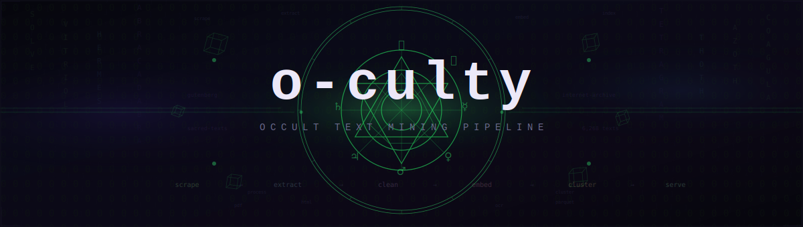

<p align="center">
  
</p>

<p align="center">
  <a href="https://huggingface.co/datasets/ebrinz/text-cult">
    
  </a>
</p>

Scrape, extract, clean, and structure occult and esoteric texts from public domain sources into a research-ready corpus.

## Pipeline

```
scrape → extract → clean → embed → cluster → serve
```

**Sources:** Project Gutenberg, Sacred Texts, Internet Archive

**Output:** Deduplicated Parquet dataset on [HuggingFace](https://huggingface.co/datasets/ebrinz/text-cult) — 6,268 texts, 305M characters.

## Setup

```bash
pip install -e .
```

## Usage

```bash
# Scrape sources
python scripts/scrape_gutenberg.py
python scripts/scrape_sacred_texts.py
python scripts/scrape_internet_archive.py

# Process raw files into clean text
python scripts/process.py              # full run with OCR
python scripts/process.py --no-ocr     # fast text-only pass

# Export to Parquet
python scripts/export_parquet.py
```

## Corpus

```python
from datasets import load_dataset

ds = load_dataset("ebrinz/text-cult")
```

| Source | Documents | Characters |
|--------|-----------|------------|
| sacred-texts | 5,873 | 85.7M |
| internet-archive | 328 | 163.9M |
| gutenberg | 67 | 55.6M |
